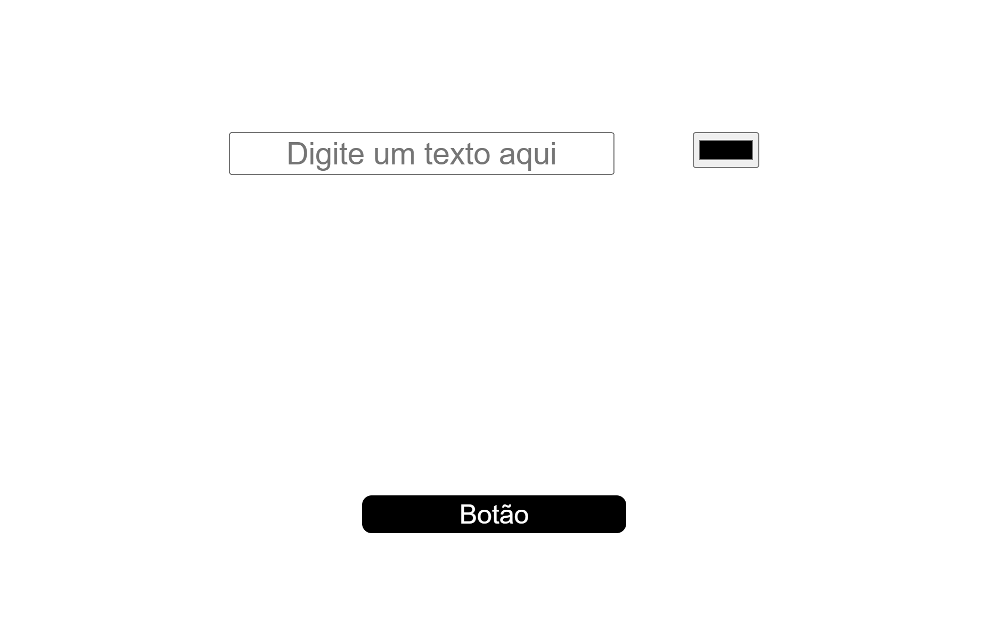

# Quest React Base

Desafio de React Básico proposto pelo curso DevQuest, mostrando o texto que o usuário escreve na cor de sua escolha e exibindo um alerta com a label do botão ao clicar nele

## Visão Geral

### Screenshot

#### Versão desktop

### Link

- Página no GitHub : [Quest React Base](https://github.com/Shyayhs/quest-react-base)

## Autor

- Linkedin - [Pedro Lucas](www.linkedin.com/in/pedro-lucas-rocha)
- Github - [@Shyayhs](https://github.com/Shyayhs)
